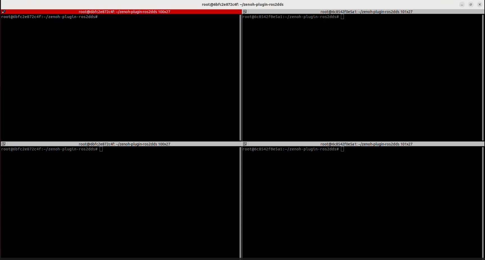
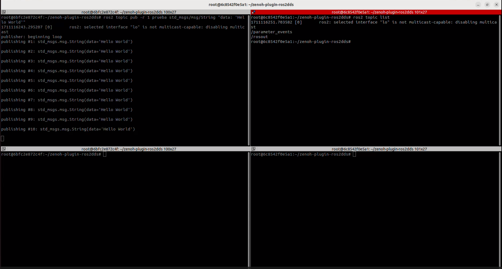
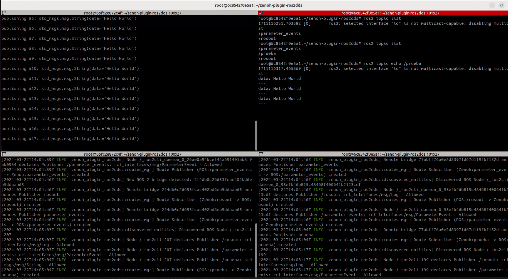

# Semana 18/03/2024

En la segunda semana de trabajo, se preparó el entorno de simulación para Zenoh. Para ello, se optó por utilizar contenedores de Docker a modo de prueba con el _plugin_.

***→ Objetivo:***  Simulación de dos elementos aislados que se comuniquen a través de la red local de Wifi gracias a Zenoh. Una vez finalizada la prueba, se puede extender el alcance de las próximas tareas para acercarnos a la aplicación real del proyecto, donde los elementos involucrados sean drones comunicándose con ordenadores u otros drones.    

Para este propósito, se ha diseñado una imagen de Docker construida a partir de un [Dockerfile](../docker/Dockerfile). Los elementos principales que se requieren en el entorno de simualción son los siguientes:  

* **ROS2:** Se utiliza como base una imagen preconfigurada de ROS2 ([osrf/ros:humble-desktop](https://hub.docker.com/layers/osrf/ros/humble-desktop/images/sha256-a0addcba1ebee8df15c2f229bd24c96e603b54a27ebe02590422a5047dcd01e2?context=explore))
* **Zenoh:** Se añade el plugin de Zenoh (https://github.com/eclipse-zenoh/zenoh-plugin-ros2dds) para tenerlo disponible en el contenedor
* **Configuración del entorno de desarrollo:** Configuramos el entorno de desarrollo instalando _Rust_, y contruyendo el plugin de Zenoh utilizando _cargo_. También se incluye la configuración de otras variables de entorno en el archivo _".bashrc"_ para optimizar el entorno de desarrollo. Por ejemplo, se restringen las conexiones al _host_ local para garantizar un aislamiento adecuado. 
* **Instalación de herramientas:** Se instalan herramientas de red necesarias, como _"net-tools"_ y _"iputils-ping"_
* **Instalación de dependencias** necesarias para el funcionamiento de todos los elementos anteriores  

Uno de los principales problemas que se encontraron a la hora de contruir una imagen adecuada fue al añadir el plugin de Zenoh. En primer lugar, se intentó una instalación similar a la que se realizó la semana pasada en el ordenador local, tal y como indican en el [repositorio de Zenoh](https://github.com/eclipse-zenoh/zenoh-plugin-ros2dds). Sin embargo, la instalación de Zenoh falla debido a un problema con `systemd`.   

> [!NOTE]
> `systemd` es un conjunto de _daemons_ de administración de sistema, bibliotecas y herramientas utilizados por los sistemas operativos de Linux. `systemd` se encarga de coordinar el arranque del sistema, la gestión de servicios, el manejo de sesiones de usuario, la administración de módulos de kernel, el seguimiento de procesos, la gestión de logs (registros) y otras tareas relacionadas con la administración del sistema. Más información sobre systemd en este [link](https://es.wikipedia.org/wiki/Systemd).  

De esta manera, debido a que el contenedor Docker no cuenta con su propio kernel, sino que lo comparte  con el sistema operativo del _host_ (nuestro ordenador local), no posee un sistema operativo completo. Por lo tanto, carece de servicios de inicialización del sistema, como `systemd`, que son necesarios para la instalación del plugin de Zenoh.  

Una posible solución encontrada fue gracias un repositorio que también pretende instalar Zenoh en su [imagen de Docker](https://github.com/icclab/rosdocked-irlab/blob/099c87dde76016631aa9d27934fee504d4b95e56/WORKSPACE/Dockerfile#L37). Se utiliza un `workaround` como recurso para completar la contrucción de la imagen. Sin embargo, esto se trata de una *solución temporal*, y no resuelve la causa subyaciente del problema, sino que solo se evita. Por ello, se tuvo que buscar otra solución que resuelva el problema.  

Como solución final se encontró que la instalación binaria resuelve el problema con `systemd`. En la instalación por fuente que se estaba realizando previamente, el código fuente se compila en el sistema. Sin embargo, en la instalación binaria utiliza un paquete binario precompilado.  

Con esto, se consiguó elaborar un [Dockerfile](../docker/Dockerfile) adecuado construir la imagen de Docker necesaria en nuestra aplicación.  

<h2> Resultados </h2>  

El primer paso fue construir la imagen con los siguientes comandos (desde el directorio en el que se encuentre el Dockerfile):  

    docker build -t ros_prueba . --progress=plain    

Una vez esperado a que se complete la imagen, se puede comprobar que se ha creado la imagen si está incluida entre las imágenes de Docker de tu sistema:  

    docker images    

A continuación, se construyen los contenedores necesarios para realizar las pruebas de simulación con Zenoh. En nuestro caso, hemos utilizado dos contenedores: `contenedor_zenoh1` y `contenedor_zenoh2`  

    docker run -it --name contenedor_zenoh1  ros_prueba:latest /bin/bash
    docker run -it --name contenedor_zenoh2  ros_prueba:latest /bin/bash  

Con esto se consiguen dos terminales de los dos contenedores mencionados.

> [!NOTE]
> Algunos comandos útiles que se han usado durante las pruebas:
> 
> + `docker ps`: Se visualizan los contenedores activos. Si se quieren visualizar todos los contenedores, activos e inactivos, se añade el argumento `-a`
> + `docker start contenedor_zenoh1`: Cuando se pretende activar un contenedor ya creado, se utiliza este comando, El comando `docker run ...` se utiliza una vez al crear el contenedor 
> + `docker exec -it contenedor_zenoh1 /bin/bash`: Añadir nueva terminal de un mismo contenedor activo  

Con todas estas herramientas, nuestro entorno de simulación para Zenoh tendría un aspecto como la imagen de debajo. En esta imagen, las terminales de la derecha corresponden a _contenedor_zenoh1_, mientras que las terminales de la izquierda, a _contenedor_zenoh2_   

  

Se puede comprobar que los contenedores no se comunican entre sí:  

 

En cambio, cuando se lanza Zenoh en cada uno de los contenedores, se ve el proceso de _Discovery_ en cada uno de ellos, permitiendo a los contenedores verse y comunicarse.  

  

## Próximas tareas

Tras las pruebas realizadas en estos contenedores, se han identificado dos problemas que deberían solucionarse:  

1. El entrypoint y los archivos que se ejecutan cuando se crea una terminal del contenedor no funcionan correctamente. En estos archivos únicamente se hace _sourcing_ de ROS2, pero no están incluidos los archivos de ROS en la nueva terminal de los contenedores, y se tienen que incluir de forma manual. Una vez creado el contenedor (con `docker run`), el entorno está configurado correctamente; sin embargo, al reactivar los contenedores de nuevo (con `docker start` y `docker exec`), no se encuentran configurados
   
2. A través de una prueba muy sencilla que consiste en desconectar la red local de Wifi del ordenador, se comprueba que se siguen comunicando los contenedores. Este resultado **no es favorable**, ya que los contenedores de Zenoh deben conectarse a través de la red local gracias a Zenoh: si se desconecta la red local, y se siguen comunicando, quiere decir que se están **comunicando internamente** por el ordenador, y eso no es el objetivo de la simulación.
