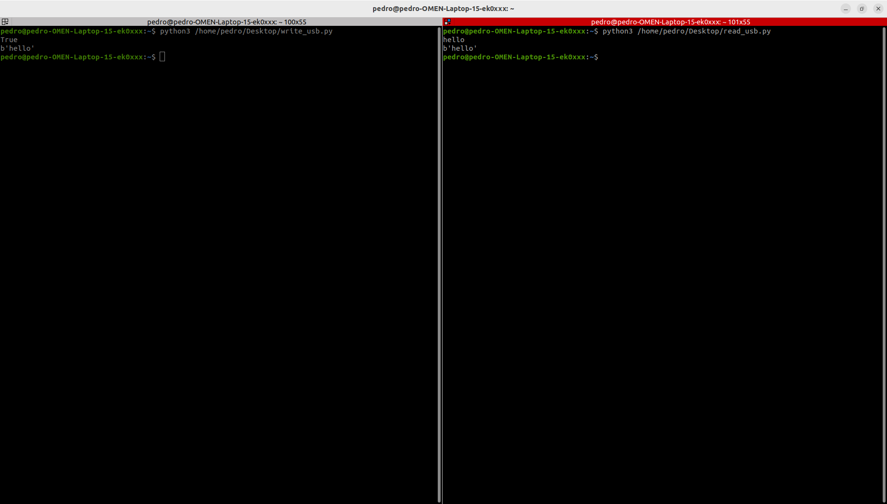

# Semana 22/04/2024  

Durante estas 3 semanas de trabajo se ha intentado utilizar _Zenoh_ con Bluetooh en la comunicación de dispositivos. A pesar del inicial fracaso de este objetivo, se han extraido unas importantes conclusiones que han ayudado a mejorar el plan conceptual del TFG.  

***→ Objetivo:*** Comunicar dispositivos con Bluetooth a través de _Zenoh_.  
***→ Objetivo:*** Entender el funcionamiento y uso de dispositivos seriales.  

El **primer objetivo** planteado fue el primer intento de utilizar Bluetooth junto con _Zenoh_. Los pasos que se estaban siguiendo son los de [este tutorial](https://zenoh.io/blog/2022-08-12-zenoh-serial/). Sin embargo, se llega a la conclusión que _Zenoh_ **no es compatible directamente con las interfaces de comunicación Bluetooth.**
En realidad, _Zenoh_ opera sobre la capa de enlace de datos, donde se encuentra Bluetooth. En otras palabras, aunque el transporte físico de los datos se realice mediante diversas tecnologías, Zenoh se encarga de la codificación y distribución de los datos.  

Por ello, la finalidad del **segundo objetivo** es utilizar dispositivos conectados a los sistemas que se desean conectar con _Zenoh_. Se han utilizado una pareja de [antenas de 433 MHz](https://ardupilot.org/copter/docs/common-sik-telemetry-radio.html) conectadas vía USB con el ordenador.  

Una vez realizados los [tutoriales de _pySerial_](https://readthedocs.org/projects/pyserial/downloads/pdf/latest/), se han realizado [dos porgramas](../pyserial) sencillos que envían información a través de las antenas.  

> [!NOTE]
> Hubo una serie de problemas por no leer correctamente la documentación y no configurar _Baudrate_ con un valor de 57600.  

  

# Próximas táreas  

1. Integrar _Zenoh_ en la comunicación de ambas antenas
