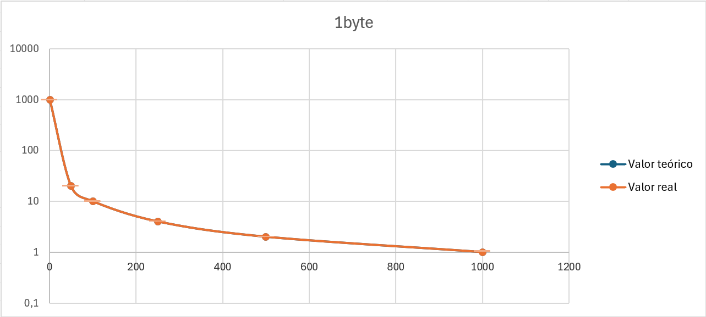
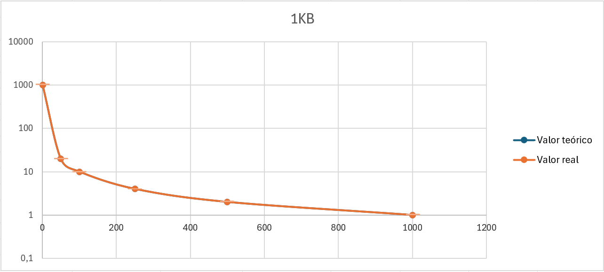
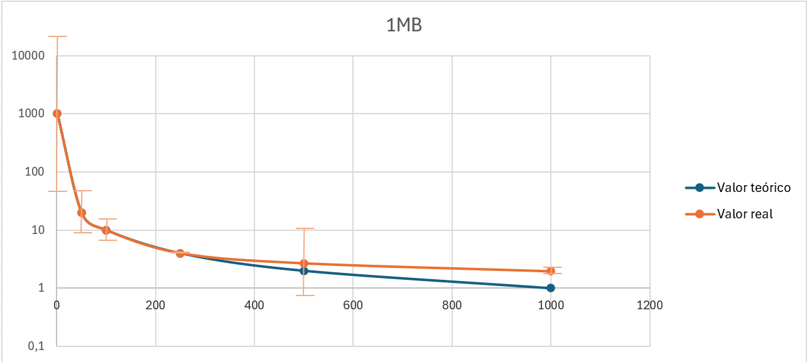
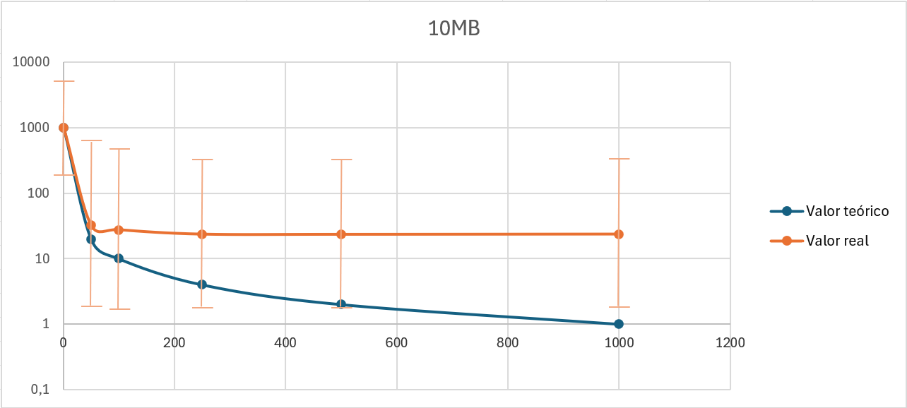
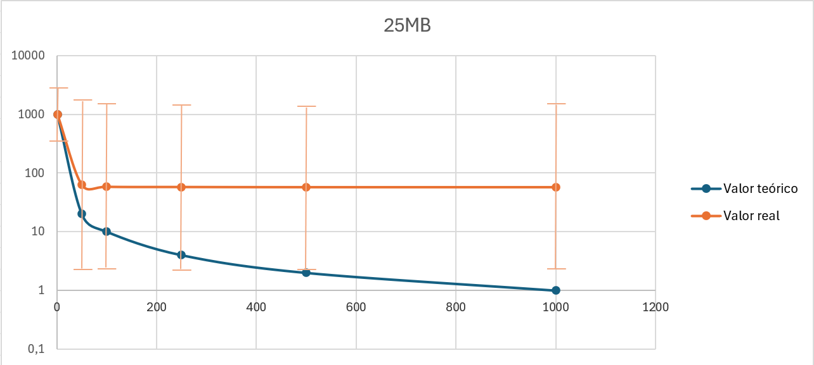
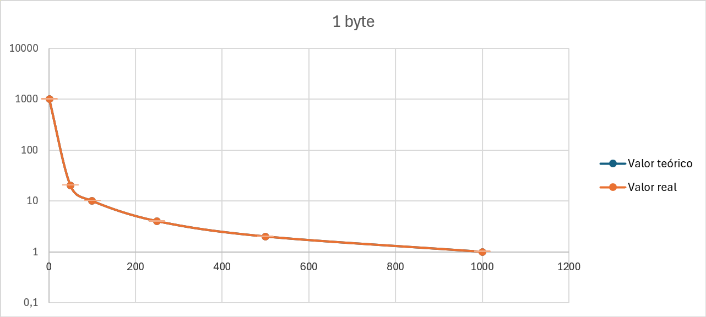
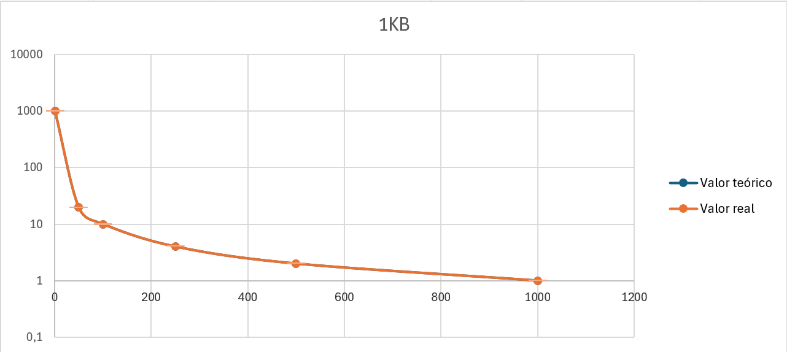
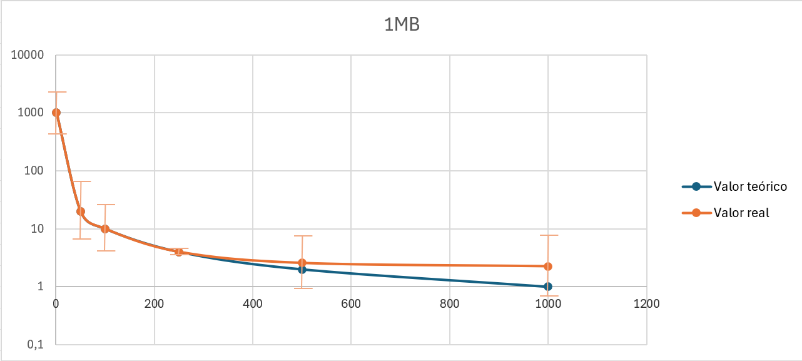
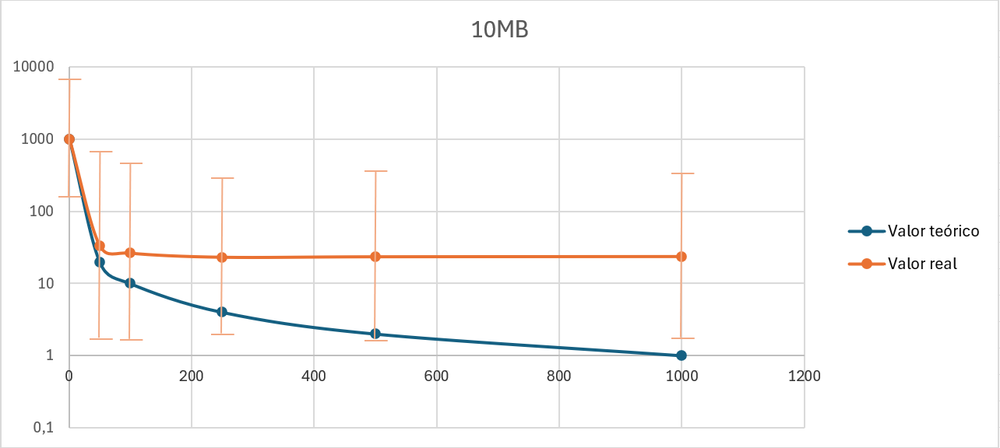
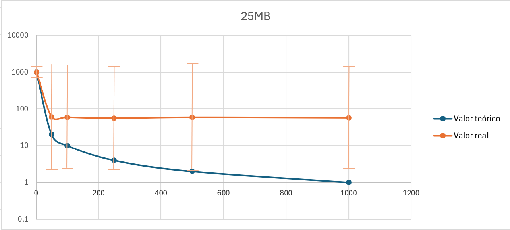

# Semana 12/06/2024  

***→ Objetivo:*** Medir los datos de interés durante el uso del bridge de _Zenoh_.  

Se ha utilizado el [tutorial de ROS](https://ftp.udx.icscoe.jp/ros/ros_docs_mirror/en/humble/Tutorials/Topics/Topic-Statistics-Tutorial.html) para realizar un nodo [talker](../analytics_ws/src/cpp_pubsub/src/publisher_member_function.cpp) que publica datos, y un nodo [listener](../analytics_ws/src/cpp_pubsub/src/member_function_with_topic_statistics.cpp) que los recibe.   

* **_talker_** Publica una cadena de _uint8_t_ de tamaño ajustable y frecuencia ajustable. También se añade un topic, llamado `/expected_data`, que recoge la cantidad de datos que se publican por el topic.  
Parámetros configurables mediante parámetros de ROS:
  * `publish_frequency`: Frecuencia de publicación de datos, en **ms**
  * `message_size`: Tamaño del dato publicado, en **bytes**
  * `topic_name`: Nombre del topic, un **_string_**

* **_listener_with_topic_statistics_** Se suscribe al topic recibido, y publica a través del topic `/statistics` algunos datos relativos al topic que se usarán para este análisis. También se añade un topic, llamado `/received_data`, que recoge la cantidad de datos que ha recibido de ese nodo.  
Parámetros configurables mediante parámetros de ROS:
  * `topic_name`: Nombre del topic, un **_string_**

Con todo esto, y las configuraciones de estas últimas semanas, se ha realizado un análisis de estrés en el uso del bridge de _Zenoh_. Se han realizado diferentes pruebas para completar la siguiente tabla de **pérdida de datos**:  

| Frecuencia de transmisión // Tamaño de datos  | 1 byte | 1KB | 1MB | 10MB | 25MB |
| :---: | :---: | :---: | :---: | :---: | :---: |
| **1 Hz** | 100.00% | 100.00% | 100.00% | 100.00% | 100.00% |
| **50 Hz** | 100.00% | 100.00% | 100.00% | 61.80%* | 32.20%* |
| **100 Hz** | 100.00% | 100.00% | 100.00% | 36.20%* | 16.90%* |
| **250 Hz** | 100.00% | 100.00% | 100.00% | 16.96%* | 6.92%* |
| **500 Hz** | 100.00% | 100.00% | 74.50%* | 8.54%* | 3.50%* |
| **1.000 Hz** | 100.00%* | 99.94%* | 51.24%* | 4.24%* | 1.72%* |

*En estos datos, se ha esperado hasta que alcancen un valor estable, pero durante ese tiempo, la pérdida de datos fue mayor   

>[!Note]  
>Se ha tomado el límite superior en el tamaño de datos porque se prevé que los datos de mayor peso que se van a transmitir van a ser imágenes:
>* **Imágenes 1080p:** 1920 x 1080 píxeles x 24 bits/píxel x 1 byte/bit = 5.93 MB
>* **Imágenes 4k:** 3840 x 2160 píxeles x 24 bits/pixel x 1 bye/bit = 23.73 MB  

A continuación se han recogido los datos para realizar un **análisis estádístico de las frecuencias** de transmisión de datos. Para ello, se ha publicado información con diferentes frecuencias (o distintos periodos en este caso, 1000ms, 20ms, 10ms, 4ms, 2ms, 1ms), y se ha observado la frecuencia con la que se reciben los datos, sacando también su valor mínimo, máximo y la desviación típica de muestras tomadas cada 10 segundos.
Los resultados se resumen en las siguientes gráficas:  

Como se puede observar, existe un límite en tamaño y frecuencia de datos que se pueden enviar a través de _Zenoh_. Este fenómeno se observa mejor en las dos últimas gráficas, donde se observa una cota inferior claramente diferenciada.  
En este caso, podemos aproximar el límite de la transmisión de datos de _Zenoh_ a **3.52 Mbps**, frente a los 250Kbps teóricos de transmisión por aire las [antenas](https://ardupilot.org/copter/docs/common-sik-telemetry-radio.html).  

También se ha repetido este experimento con el wifi del departamento, se han obtenido los siguientes resultados:  

**Pérdida de datos:**  

| Frecuencia de transmisión // Tamaño de datos  | 1 byte | 1KB | 1MB | 10MB | 25MB |
| :---: | :---: | :---: | :---: | :---: | :---: |
| **1 Hz** | 100.00% | 100.00% | 100.00% | 100.00% | 100.00% |
| **50 Hz** | 100.00% | 100.00% | 100.00% | 59.40%* | 32.60%* |
| **100 Hz** | 100.00% | 100.00% | 100.00%* | 37.90%* | 17.20%* |
| **250 Hz** | 100.00% | 100.00% | 99.96%* | 17.28%* | 7.24%* |
| **500 Hz** | 100.00% | 100.00% | 77.58%* | 8.52%* | 3.40%* |
| **1.000 Hz** | 100.00%* | 99.94%* | 44.27%* | 4.22%* | 1.75%* |  

**Análisis de frecuencias:**  

  

Se puede observar que al usar wifi se obtienen unos datos similares a los resultados obtenidos con las antenas, aunque ligeramente menos favorables.  
También se observa la cota del límite inferior observado en las pruebas con las antenas en el análisis de frecuencias. Tabmién se puede calcular que en las pruebas realizadas con wifi, el límite de transmisión de datos de _Zenoh_ vale **3.52 Mbps**, frente a los 867 Mbps teóricos de transmisión del [router utilizado](https://static.tp-link.com/upload/product-overview/2023/202308/20230824/Archer%20AX18(EU)1.0_Datasheet.pdf). Este valor coincide en ambos experimentos.

## Próximas tareas

Comprobar la utilidad de _Zenoh_ en algún caso real de _aerostack2_.
