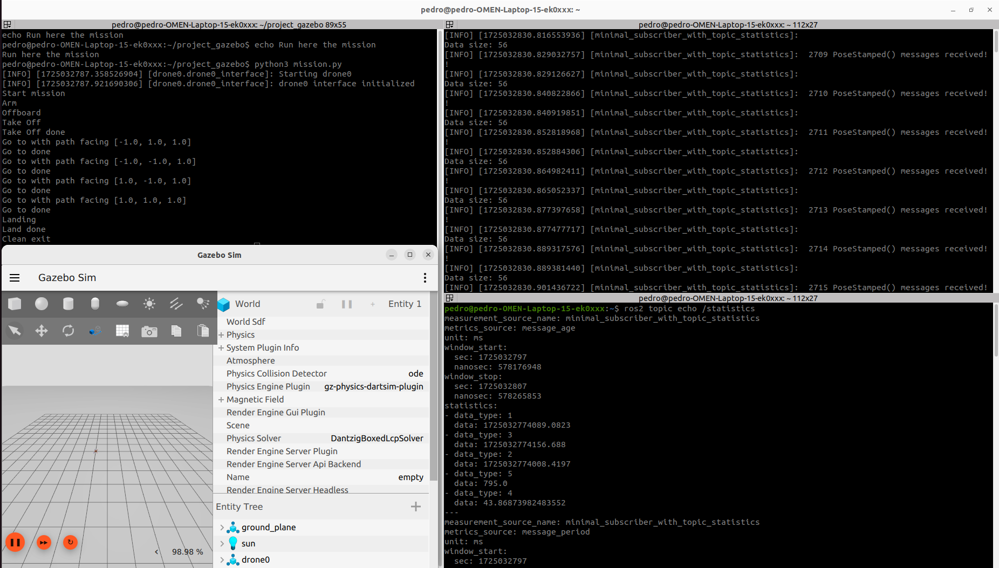

# Semana 26/08/2024  

***→ Objetivo:*** Estudiar el uso de _Zenoh_ en una aplicación real  

Para estudiar el uso de _Zenoh_ en aplicaciones reales, se ha utilizado el framework de [Aerostack2](https://aerostack2.github.io/), un framework desarrollado por el [CVAR](https://www.upm.es/recursosidi/map/vision-por-computador-y-robotica-aerea/) de la Universidad Politécnica de Madrid.  

### ¿Qué es Aerostack2?  

[Aerostack2](https://aerostack2.github.io/) es un framework de software de código abierto diseñado para ayudar a los desarrolladores a crear y construir la arquitectura de control de sistemas robóticos aéreos. Este proyecto tiene gran modularidad e independencia de software, por lo que se puede utilizar parte de los paquetes del proyecto para la aplicación específica a desarrollar.  
Para comprobar el uso de _Zenoh_ utilizaremos varias aplicaciones que tiene  disponibles en su [repositorio](https://github.com/aerostack2/aerostack2?tab=readme-ov-file), y se medirá y valorará el uso de _Zenoh_ en aplicaciones similares.  

### Simulador SIN ZENOH  

En esta primera prueba se ha seguido el [ejemplo básico de Gazebo](https://aerostack2.github.io/_02_examples/gazebo/index.html). Una vez seguidos los pasos del tutorial, se puede ver una simulación con un dron que es capaz de ejecutar una misión sencilla, que consiste en: despegar, trayectoria de 4 puntos, y aterrizar.  

En este primer ejemplo se ha medido algunos datos de interés que se utilizarán para comparar el mismo ejemplo usando _Zenoh_.  
Lo primero que se ha realizado ha sido modificar el [nodo de analytics_ws](../analytics_ws/src/cpp_pubsub/src/member_function_with_topic_statistics.cpp) con el que se obtenían estadísticas de otros topics. En este nuevo nodo se pueden obtener estadísticas de otros topics que no sean de tipo _String_, así como recibir el nombre del topic a través de un argumento de ROS.  

Con esta preparación, se han seleccionado los siguientes topics para realizar el estudio:  

1) 
*  **Nombre:** /drone0/sensor_measurements/battery
*  **Tipo de mensaje:** sensor_msgs/msg/BatteryState
*  **Frecuencia estimada:** 50 Hz
*  **Tamaño estimado:** 12 bytes

2)
*  **Nombre:** /drone0/self_localization/pose
*  **Tipo de mensaje:** geometry_msgs/msg/PoseStamped
*  **Frecuencia estimada:** 100 Hz
*  **Tamaño estimado:** 56 bytes

3)
*  **Nombre:** /tf
*  **Tipo de mensaje:** tf2_msgs/msg/TFMessage
*  **Frecuencia estimada:** 500 Hz
*  **Tamaño estimado:** 56-224-560 bytes

En esta aplicación, el tamaño de los mensajes que se transmiten con los topics no son muy grandes, ninguno sobrepasa 1KB. Sin embargo, se han tomado diferentes frecuencias estimadas para tomar topics significativos respecto a las tablas de la [semana 7](Semana7.md).  

Así, los datos obtenidos son los siguientes:  

| Nombre | Periodo Medio [ms] | Periodo Mínimo [ms] | Periodo Máximo [ms] | Desviación típica | Nº de mensajes |
| :--- | :---: | :---: | :---: | :---: | :---: |
| /drone0/sensor_measurements/battery | 20,7264 | 19,7749 |	24,2488 |	1,3631 | 485 |
|  | 20,6107 |	19,8842 |	24,2787 |	1,2500 | 485 |
|  | 20,6350 |	19,8911 |	24,1211 |	1,2802 | 485 |
|  | 20,5889 |	19,8478 |	24,2242 |	1,2222 | 485 |
| /drone0/self_localization/pose | 12,0753 |	11,1039 |	12,8933 |	0,1425 | 746 |
|  | 12,0735 |	10,7050 |	13,7140 |	0,1671 |	828 |
|  | 12,0726 |	11,4359 |	12,7817 |	0,1357 |	828 |
|  | 12,0729 |	11,2888 |	13,0958 |	0,1362 |	829 |
| /tf | 2,0283 | 0,0253 |	12,3017 |	1,9985 |	4896 |
|  | 2,0123 |	0,0251 |	4,9502 |	1,9583 |	4968 |
|  | 2,0130 |	0,0254 |	4,9879 |	1,9588 |	4969 |
|  | 2,0125 |	0,0252 |	5,1987 |	1,9587 |	4968 |   

_Tabla 1: Cálculo de la frecuencia esperada para los topics indicados_

Con estos resultados se pueden agrupar los datos en la siguiente tabla, que es la que se va a utilizar para comparar con las pruebas con _Zenoh_:  

| Nombre | Periodo Medio [ms] | Periodo Mínimo [ms] | Periodo Máximo [ms] | Frecuencia [Hz] | Nº de mensajes |
| :--- | :---: | :---: | :---: | :---: | :---: |
| /drone0/sensor_measurements/battery | 20,6403 |	19,7749 |	24,2787 |	48,44898588 | 485 |
| /drone0/self_localization/pose | 12,0736 |	10,7050 |	13,7140 |	82,82558654 | 828 |
| /tf | 2,0165 |	0,0251 |	12,3017 |	495,8972251 | 4968 |  

_Tabla 2: Valores promedios de las frecuencias esperadas._  

### Simulador CON ZENOH  

Para estudiar el uso de _Zenoh_ se ha repetido el mismo entorno simulado que la prueba anterior, y se ha añadido un contenedor Docker con _Zenoh_ y el nodo de las estadísticas preparado.  

La comunicación entre el entorno de simulación (que simula un dron real) y el contenedor Docker (que simula un ordenador de control diferente) se ha realizado entre dos antenas, de manera similar al proceso seguido en la [semana 6](Semana6.md). Además, se ha actualizado el nodo del que se obtienen las estadísticas, y se ha añadido un archivo de configuración de _Zenoh_ para filtrar los topics.    

Con esta preparación, se pretende que el ordenador local emita información del dron durante la misión en la simulación, y ver qué datos se reciben en el entorno dockerizado, así como estudiar la calidad de esta comunicación.  

Con la preparación explicada, se han obtenido los siguientes resultados:  

| Nombre | Periodo Medio [ms] | Periodo Mínimo [ms] | Periodo Máximo [ms] | Desviación típica | Nº de mensajes |
| :--- | :---: | :---: | :---: | :---: | :---: |
| /drone0/sensor_measurements/battery | 20,5822 |	19,2788 |	25,0686 |	1,2096 |	482 |
|  |20,5679 |	19,6755 |	24,6103 |	1,1591 |	486 |
|  | 20,5176 |	19,6808 |	24,2614 |	1,0958 |	487 |
|  | 20,5261 |	19,6069 |	24,1569 |	1,1176 |	487 |
| /drone0/self_localization/pose | 12,1792 |	10,8949 |	13,7083 |	0,4011 |	818 |
|  | 12,1770 |	10,4478 |	13,3672 |	0,3868 |	822 |
|  | 12,1830 |	10,5237 |	13,8934 |	0,4417 |	820 |
|  | 12,1766 |	11,0706 |	16,5592 |	0,3781 |	822 | 
| /tf | 2,0291 |	0,0402 |	10,7770 |	2,2332 |	4895 |
|  | 2,0289 |	0,0415 |	7,6981 |	2,2370 |	4930 |
|  | 2,0289 |	0,0410 |	7,3349 |	2,2453 |	4928 |
|  | 2,0281 |	0,0395 |	7,5423 |	2,2350 |	4931 |  

_Tabla 3: Cálculo de la frecuencia usando Zenoh_

Estos resultados se pueden agrupar en la siguiente tabla:  

| Nombre | Periodo Medio [ms] | Periodo Mínimo [ms] | Periodo Máximo [ms] | Frecuencia [Hz] | Nº de mensajes |
| :--- | :---: | :---: | :---: | :---: | :---: |
| /drone0/sensor_measurements/battery | 20,5485 |	19,2788 |	25,0686 |	48,66545934 | 486 |
| /drone0/self_localization/pose | 12,1790 |	10,4478 |	16,5592 |	82,10883011 | 820 |
| /tf | 2,0287 |	0,0395 |	10,7770 |	492,9154613 | 4930 |  

_Tabla 4: Valores promedios del uso de Zenoh en la aplicación_  

### Conclusiones

En primer lugar, la deferencia de la **frecuencia de la comunicación** usando _Zenoh_ es muy similar a la que se obtiene si no se usa. Para todos los casos, se obtiene una diferencia < 1%.  

| /drone0/sensor_measurements/battery | /drone0/self_localization/pose | /tf |
| :---: | :---: | :---: |
| 0,45 % | 0,87 % | 0,60 % |  

_Tabla 5: Diferencia entre la frecuencia esperada sin Zenoh, y la frecuencia obtenida usando Zenoh_

En segundo lugar, se observa que en algunos casos sí existe una pérdida de datos en la comunicación. Aunque esta pérdida de datos sea relativamente pequeña, el resultado es sorprendente, ya que según la primera columna de las tablas de la [semana 7](Semana7.md), se esperaba que no hubiera pérdida de datos en la transmisión. Esta pérdida de datos se reduce tras un tiempo de establecimiento.  

| /drone0/sensor_measurements/battery | /drone0/self_localization/pose | /tf |
| :---: | :---: | :---: |
| 100 % | 99,03 % | 99,23 % |  

_Tabla 6: Porcentaje de datos transmitidos de un sistema a otro usando Zenoh._
